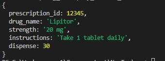

## Problem 1
- src/one.ts

## Problem 2
- src/two.ts 
- ```npm run test```

## Problem 3
- result: 
- type: optional Object: interface IPrescription {
        prescription_id?: number,
        drug_name?: string,
        strength?: string,
        instructions?: string,
        dispense?: number
    }

